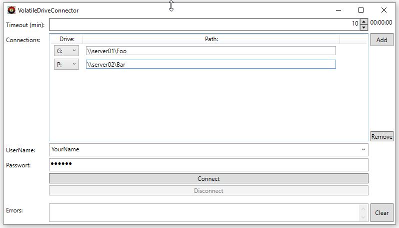

# VolatileDriveConnector

Have you ever had to share an account with other people, for instance on a measuring device? If not, then you probably don't need this program.
If yes, then you may have the problem, that you need to connect network drives with your
own user account (not with the shared account). This can be annoying, especially when more
than one connection is needed, because for every connection you have to enter your user name and password again.

Moreover, the even bigger problem is that the connections are not closed when you leave the PC,
so other people using this shared account can now access your personal data!

This is the reason for using VolatileDriveConnector. You can connect one or multiple
drives using your own account, and as I noted before, the focus is on disconnecting the drives again.
Your connections are closed if you close the program, if the countdown timer runs out, if the PC is locked, and if
you explicitely disconnects. Even if you forget to log out or to lock the computer, after a
user defined time your drives will be disconnected automatically!

But please be aware that while the risk to unauthorized access is reduced a lot, it is not fully eliminated. See section "Gaps" below.

## When will your drives be connected

 - If you press the button `Connect`
 - If the cursor is in the password box and you press `ENTER`

## When will your drives be disconnected

- If the button `Disconnect` is pressed
- When the countdown timer has elapsed
- When the computer gets locked 
- When the program is closed

## General usage (for the first time)

- Start the program
- Enter your user name (see the notes below if you want to copy some connections from other users)
- Add connections. First press the `Add button`, and then choose the drive letter and enter the UNC
path of your connection into the list item that was created. Repeat this step for 
every connection you need.
- Enter your password and then either press `ENTER`, or press the button `Connect`
- Your connections now should be established for the Timeout period that was given.
- If you prematurely want to close the connections, press the `Disconnect` button (or close the program).

## General usage (not the first time)
- Start the program
- If the user name shown in the combobox is yours, then enter the password and press `ENTER`
- If not, then choose your user name from the combobox, enter the password and press `ENTER`

## Notes

- The user information (user names, connections drives and paths, timeout period) is stored as an
XML settings file in the application settings directory. This file is not encrypted, because the information
it contains is considered public (passwords are not stored in it).

- The settings file is stored every time when a connection is established (the user presses the `Connect` button or `ENTER` in the password box)..

- It is possible to store individual connection information for multiple users. This 
information is considered public, i.e. another user using the program can see that information.

- If you want to copy connection information from another user, choose that other user name,
so that the connection information of that user is shown, and then type in your own user name.

- Type in your password and press `Connect` in order to store that information in the settings file.

- The password you entered is deleted immediately after the connection operation,
and is not stored anywhere in the program. That means, that if you want to reconnect, you have to type it in again.

- In the UNC paths, you can use environment variables, or the user name you typed in.
Put the name of the environment variable in <> chars, like in this example here: `\\server01\<USERNAME>`. When connecting, `<USERNAME>` is replaced
by the value of the environment variable `USERNAME`. 
USERNAME is a special case, because in most cases you don't want to use the environment variable, but the user name
you typed into the program. In order to use that user name, use instead `\\server01\<UserName>`. Note the case sensitivity here:
`USERNAME` means the environment variable, `UserName` means the user name you typed in!
## Gaps

- If another user has access to the PC, and you have not disconnected before or locked the computer, and the timer has not elapsed yet,
than that user has access to your connected drives.

- Moreover, in the situation above, the user can kill the program, so that automatic disconnection
never happens. Afterwards, the user has time-unlimited access to the drives.

## Conclusion

Use the program to connect your drives, then if the work is done,
disconnect explicitely or close the program. Consider the timeout feature 
to be only the last resort for forgetful people!

## Requirements

This programs uses .NetFramework 4.8, which is installed by default on computers running Windows 7, Windows 8.1, Windows 10 and Windows 11.
The program is a single .exe file, which needs no installation. No registry entries are added or changed. The program
creates a settings file in the application data directory (`APPDATA` environment variable).